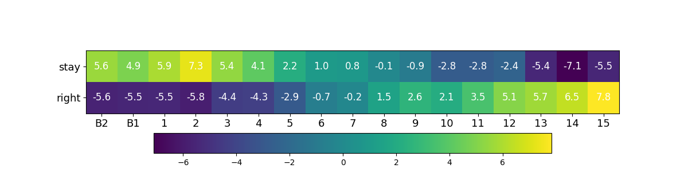

# elevator-selection-problem
Which elevator is the most efficient?

## Explanation

You take the elevator from your apartment to your house. The entrance is on the left, and there are two elevators. As you enter the entrance on the left, you don't know what floor the right elevator is on. Your house is further to the right than the right elevator. If the left elevator is on a higher floor, it might be better to take the right elevator. However, if the right elevator is further up, it will take longer. So, what floor is the left elevator on, and is it better to go to the right elevator?

당신은 아파트에서 엘리베이터를 타고 집으로 갑니다. 입구는 왼쪽에 있으며 엘리베이터는 두 개가 있습니다. 왼쪽의 입구로 들어갈 때 오른쪽 엘리베이터가 몇 층에 있는지는 알 수 없습니다. 당신의 집은 오른쪽 엘리베이터보다 더 오른쪽에 위치합니다. 왼쪽 엘리베이터가 높은 층에 있다면 오른쪽 엘리베이터로 가는 것이 더 좋을 수도 있습니다. 하지만 오른쪽 엘리베이터가 더 위에 있다면 시간이 더 오래 걸릴 것입니다. 그렇다면 왼쪽 엘리베이터가 몇 층일 때 오른쪽 엘리베이터로 가는 것이 더 좋을까요?

## precondition

There is no floor 0. Both elevators are assumed to be stopped and no one is attempting to get on.

0층은 없습니다. 두 엘리베이터는 멈춰있다고 가정하며 누군가가 타려고 시도하지 않는 것으로 가정합니다.

## Example

* Left Elevator : B2~15
* Right Elevator : B3~16
* iteration : 10M
* step-size : 0.05

